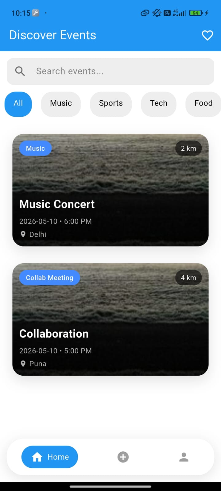
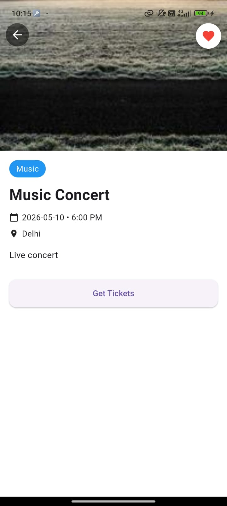
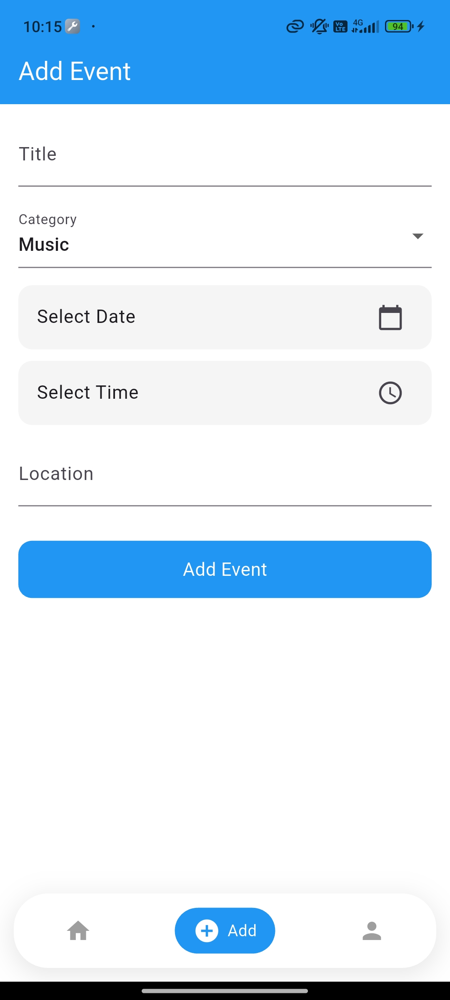
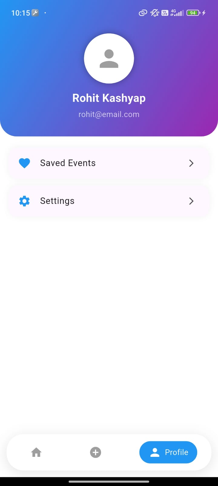
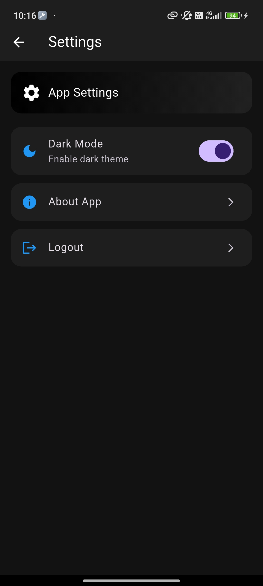

# 📅 Event Finder App

A modern **Flutter-based Event Finder App** that allows users to discover, explore, and interact with events in a clean and user-friendly interface.

---

## 🚀 Features

* ❤️ Like / save favorite events
* 📱 Clean and responsive UI
* ⚡ Fast performance with optimized state management
* 🧭 Smooth navigation using routing

---

## 🛠️ Tech Stack

* **Frontend:** Flutter, Dart
* **State Management:** Riverpod
* **Backend:** Supabase
* **Routing:** Go Router
* **UI:** Material Design

---

## 📸 Screenshots

 <p align= "center">
 
 
 
 </p>


---

## 📂 Project Structure

```
lib/
│── core/           # Theme, constants, utilities
│── features/       # App screens (UI)
│── providers/      # State management
│── models/         # Data models
│── services/       # API / backend logic
│── main.dart       # Entry point
```

---

## ⚙️ Installation

1. Clone the repository:

   ```bash
   git clone https://github.com/your-username/event-finder-app.git
   ```

2. Navigate to project:

   ```bash
   cd event-finder-app
   ```

3. Install dependencies:

   ```bash
   flutter pub get
   ```

4. Run the app:

   ```bash
   flutter run

---

## 🤝 Contributing

Contributions are welcome!
Feel free to fork this repo and submit a pull request.

---

## 📧 Contact

**Rohit Kashyap**

* GitHub: https://github.com/Rohit-kashyap857
* Email: [kashyaprohit9214@example.com](mailto:kashyaprohit9214@example.com)

---

⭐ If you like this project, give it a star!
